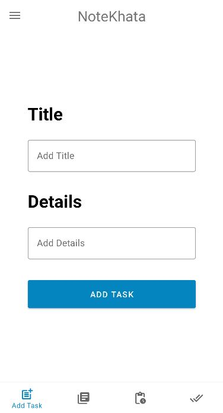
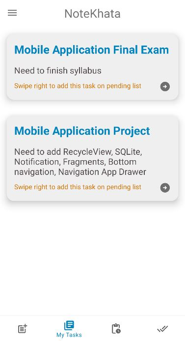
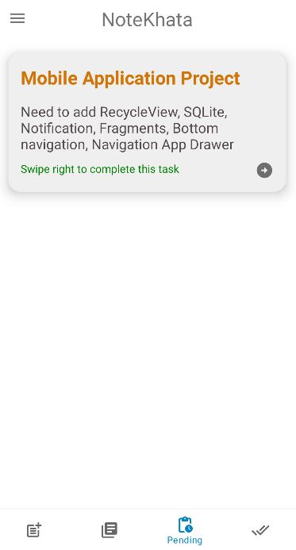
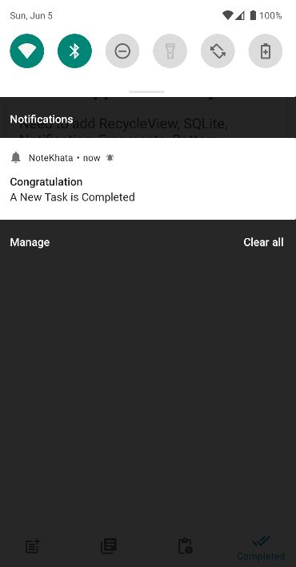
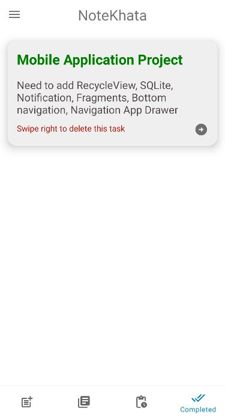
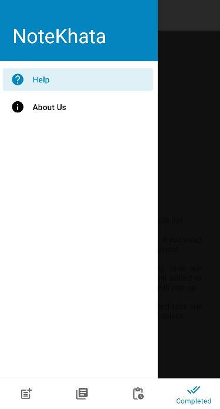
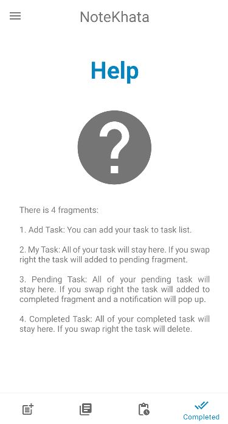
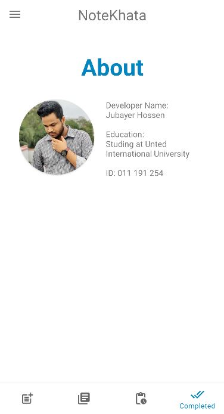
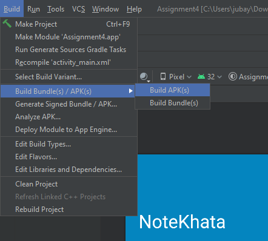

# NoteKhata

## Project Overview
NoteKhata is a task management app. Basically it's a `TO-DO` Application. User can track his tasks by noting down to the application.

## Developed Using
* Programing Languages: Java, XML
* Operating System: Android
* IDE Info: Android Studio Bumblebee | 2021.1.1 Patch 1
* Other Info:   
    * Build #AI-211.7628.21.2111.8139111, built on February 2, 2022
    * Runtime version: 11.0.11+9-b60-7590822 amd64
    * VM: OpenJDK 64-Bit Server VM by Oracle Corporation
    * GC: G1 Young Generation, G1 Old Generation

## Developed By
* Jubayer Hossen  
* Email: `jhossen191254@bscse.uiu.ac.bd`  
* BSc in Computer Science and Engineering  
* United International University

## Features List

* There are 4 fragments in `Bottom Navigation Bar`:
  * `Add Task Fragment`: You can add your task to task list.  
    
    
  
  * `My Task Fragment`: All of your task will stay here. If you swap right the task will added to `Pending Fragment`.

    

  * `Pending Fragment`: All of your pending task will stay here. If you swap right the task will added to `Completed Fragment` and a notification will pop up.

       

  * `Completed Fragment`: All of your completed task will stay here. If you swap right the task will delete.

     

* There are 2 fragments in `Navigation Drawer`:
   * `Help Fragment` The application has the details about how to use the application at `Help Fragment`.

      

  * `About Fragment`: The application has the details about the developer at `About Fragment`. 
  
      

## How to Run on IDE
Just download the `.zip` and open as a project.

## How to Run on Android Device
* Go to `Build`->`Build Bundle(s) / APK(s)`->`Build APK(s)` of `Android Studio`.  

   

* Then locate the apk and install the apk on your device. Enjoy :grinning:
